## Serverless Data Processing Pipeline

This project implements a serverless data processing pipeline using AWS services. When a CSV file containing smartphone sales data is uploaded to an S3 bucket, a series of Lambda functions are triggered to process the data, analyze it using an Amazon Bedrock model, and send email notifications with the results. The entire infrastructure is defined using Terraform and deployed via AWS CodePipeline.

- The `infrastructure/` directory in this repository contains the actual codes for lambda functions and the infrastructures of the serverless architecture.
- The `codepipeline/` directory contains the terraform code to create a codepipeline to deploy the infrastructure code from the `infrastructure/` directory. This is treated as a separate terraform project and is applied manually first to create the pipeline. After that, any changes pushed to the main branch will trigger the pipeline to deploy the changes automatically.

## Architecture Diagram

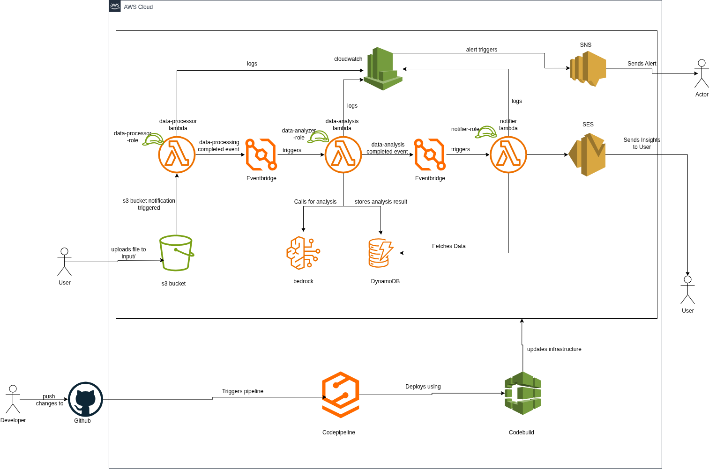

Basic flow:
- A CSV file is uploaded to the `input/` folder in the S3 bucket.
- The `data_processor_lambda` function is triggered by the S3 event. It processes the file, validates the records, and categorizes them into valid and invalid records. The valid records are stored in the `processed/` folder and the invalid records in the `rejected/` folder in the same S3 bucket. It also ensures idempotency by checking if the file has already been processed using the ETag of the S3 object.
- Once the processing is complete, an event is published to EventBridge to trigger the `data_analyzer_lambda` function.
- The `data_analyzer_lambda` function analyzes the processed data using an Amazon Bedrock model. It generates insights, identifies anomalies, and provides recommendations based on the data. The results are then stored in a DynamoDB table for further use.
- Once the analysis is complete, another event is published to EventBridge to trigger the `notifier_lambda` function.
- The `notifier_lambda` function sends email notifications with the analysis results using Amazon SES. It retrieves the analysis results from DynamoDB, formats them into an email body, and sends the email to a predefined recipient. It also updates the DynamoDB record to mark that the notification has been sent.


## Setup Guides
- Clone the repository to your local machine.
  ```bash
  git clone git@github.com:madhuSudanSharma1/Serverless-Data-Processing.git
  cd Serverless-Data-Processing
  ```
- Configure AWS CLI with appropriate credentials and region.
  ```bash
  aws configure
  ```
- Ensure you have Terraform installed on your machine.
- Navigate to the `codepipeline/` directory.
  ```bash
  cd codepipeline
  ```
- Create a Codestar connection with Github to allow AWS CodePipeline to access the repository manually from AWS Console and copy and add the name of the connection in the `terraform.tfvars` file. Also update the `repository_name` and `branch_name` variables in the `terraform.tfvars` file.
- Initialize Terraform, validate and plan.
  ```terraform
  terraform init
  terraform validate
  terraform plan -out=tfplan
  ```
- Apply the Terraform plan to create the CodePipeline.
  ```bash
  terraform apply tfplan
  ```
- Once the pipeline is created, it will automatically deploy the infrastructure code from the `infrastructure/` directory. You can monitor the progress in the AWS CodePipeline console.
- After the pipeline completes successfully, the infrastructure will be set up and ready to use.
- Make sure to verify the following before testing:
  - The model used `Amazon Nova Lite` is available after requesting access.
  - A bucket for terraform state is created and the backend configuration in `infrastructure/` directory is updated accordingly.
  - The email address used in the `notifier_lambda`  function is verified in Amazon SES.
- Upload a sample CSV file to the `input/` folder in the S3 bucket to trigger the pipeline using CLI as:
  ```bash
  aws s3 cp <path-to-your-csv-file> s3://madhu-data-processing-bucket/input/
  ```


## Lambda Functions

### 1. `data_processor_lambda`

- **Purpose:** To process the uploaded CSV file, validate the records, categorize them into valid and invalid records, and store them in respective folders (`processed/` for valid records and `rejects/` for invalid records) in the same S3 bucket. It also ensures idempotency by checking if the file has already been processed using the ETag of the S3 object.
- **Trigger:** This function is triggered when a new file is uploaded to the `input/` folder in the S3 bucket.
- It contains following functions:
  - `lambda_handler:` Entry point for the lambda function
  - `log_events:` Function for structured logging of events
  - `create_response:` Function to create a standard response format
  - `is_already_processed:` Function to check if the file has already been processed (idempotency check). It used the metadata stored in previous runs which are stored in S3 object itself. Compares the Etag of the current file with the Etag stored in metadata.
  - `process_csv_file`: Function to process the CSV file. It reads the file, validates each record, and categorizes them into valid and invalid records.
  - `process_csv_file_with_retries:` It calls the `process_csv_file` function with retries in case of errors.
  - `validate_smartphone_record:` Function to validate each record in the CSV file. It checks for required fields, data types, and value ranges.
  - `upload_csv_to_s3:` Function to upload the processed CSV files to s3 based on the category (valid/invalid).
  - `upload_result:` It calls the `upload_csv_to_s3` function to upload the processed/rejected files to S3 with appropriate metadata.
  - `publish_processing_complete_event:` Function to publish an event to EventBridge once the processing is complete. This is used to trigger the next Lambda function (`data_analyzer_lambda`) in the workflow.

### 2. `data_analyzer_lambda`

- **Purpose:** This Lambda function analyzes the processed data using an Amazon Bedrock model. It generates insights, identifies anomalies, and provides recommendations based on the data. The results are then stored in a DynamoDB table for further use.
- **Trigger:** This function is triggered by an EventBridge event when the `data_processor_lambda` function completes successfully.
- It contains following functions:
  - `lambda_handler:` Entry point for the lambda function
  - `log_events:` Function for structured logging of events
  - `create_response:` Function to create a standard response format
  - `download_processed_data:` Function to download the processed data from S3.
  - `create_analysis_prompt:` Function to create the prompt for Bedrock model. It includes the system prompt, user query, and the processed data.
  - `analyze_with_bedrock:` Function to call the Bedrock model with the prompt and get the analysis results.
  - `parse_bedrock_response:` Function to parse the response from the Bedrock model in a format to store in DynamoDB.
  - `store_analysis_results:` Function to store the analysis results in DynamoDB.
  - `publish_analysis_complete_event:` Function to publish an event to EventBridge once the analysis is complete. This is used to trigger the next Lambda function (`notifier_lambda`) in the workflow

### 3. `notifier_lambda`

- **Purpose:** This Lambda function sends email notifications with the analysis results using Amazon SES. It retrieves the analysis results from DynamoDB, formats them into an email body, and sends the email to a predefined recipient. It also updates the DynamoDB record to mark that the notification has been sent.
- **Trigger:** This function is triggered by an EventBridge event when the `data_analyzer_lambda` function completes successfully.
- It contains following functions:
  - `lambda_handler:` Entry point for the lambda function
  - `log_events:` Function for structured logging of events
  - `create_response:` Function to create a standard response format
  - `convert_decimal:` Function to convert Decimal types to float for JSON serialization as DynamoDB stores numbers as Decimal.
  - `get_analysis_details:` Function to get the analysis details from DynamoDB from the `analysis_id` passed in the event.
  - `generate_email_body:` Function to generate the email body in HTML using the analysis results.
  - `send_email_notification:` Function to send the email notification using Amazon SES.
  - `mark_notification_sent:` Function to update the DynamoDB record to mark that the notification has been sent.

## Eventbridge

Eventbridge is an AWS service that enables you to build event-driven applications by connecting various AWS services and third-party applications by routing events between them. It acts as a central hub for event management, allowing you to create rules that determine how events are processed and where they are sent based on the events.

#### Role of Eventbridge in this project:

- Invoke the `data-analyzer-lambda` function once the execution of `data-processor-lambda` is successful.
- Invoke the `notifier-lambda` function once the execution of `data-analyzer-lambda` is successful.

> **Question may arise why not invoke the other function through lambda itself.** 
The reason is to decouple the functions and make them independent of each other. This way, if one function fails, it does not affect the other functions. It also makes it easier to add or remove functions in the future without affecting the existing functions.

So, the use of Eventbridge helps:

- **Loose Coupling:** By decoupling the functions, we can change or update one function without affecting the others.
- **Scalability:** Eventbridge can handle a large number of events and can scale automatically based on the number of events.
- **Reliability:** Eventbridge ensures that events are delivered to the target functions even if they are temporarily unavailable.
- **Flexibility:** Eventbridge allows us to create complex event routing rules based on various criteria, making it easier to manage and process events.

## Security Measures Taken

#### IAM Least Privilege

- Each Lambda function has a dedicated IAM Role with the minimum required permissions:
  - **Data Processor:** Limited to S3 and EventBridge PutEvents.
  - **Data Analyzer:** Limited to S3 read, DynamoDB CRUD, EventBridge publish, and Bedrock model invocation.
  - **Notifier:** Limited to DynamoDB read, update and SES send operations.
- CodeBuild and CodePipeline roles have permissions scoped to only the necessary resources.


#### S3 Bucket Security

- Versioning enabled.
- Server-Side Encryption (AES-256) enforced at bucket level.
- Lifecycle rules move old data to cheaper storage using S3 Intelligent-Tiering after 30 days and expire after 1 year.
- Public access blocked at bucket level.

## Error Handling and Retries Strategy

- Each function has basic error handling with try/except to log issues clearly in CloudWatch Logs.
- CloudWatch Alarms notify via SNS email if lambda functions fails.
- Exponential backoff strategy is implemented for retrying transient errors.

I have used Exponential Backoff strategy in retries in the `data_processor_lambda` function while processing the CSV file. In case of transient errors (like network issues, high concurrent requests), the function retries the operation with increasing wait times between attempts. Using Exponential Backoff helps to reduce the load on the system and gives the time for the system to cool down before retrying the operation.

## Sample input and output

### Sample input data

```csv
order_id,date,model,brand,release_year,price,region,customer_review,ram,storage,color
ORD1000,2024-05-20,Find N2 Flip,Oppo,2023,899,Africa,Great foldable phone with smooth folding mechanism. Camera quality is excellent for social media.,12,256,Silver
ORD1001,2025-01-03,Reno 13 Pro,Oppo,2025,499,South America,Fast charging is amazing and the camera AI features work well in low light conditions.,8,128,Silver
```

### Screenshots

- S3 bucket structure (input/, processed/, rejected/).
  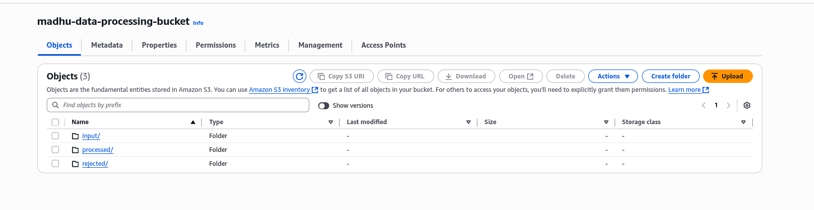
- New file uploaded to input/ folder using CLI.
  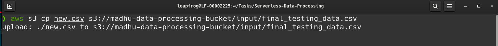
- A file `final_testing_data.csv` uploaded in input/ folder.
  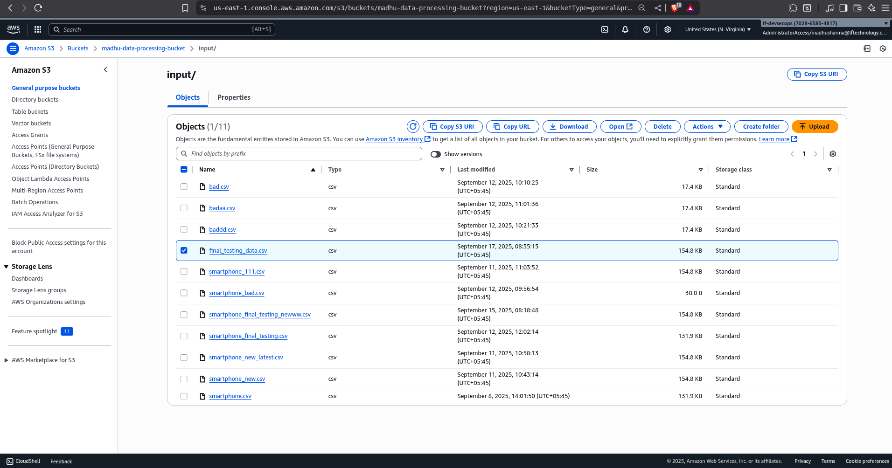
- Sample of Uploaded data:
  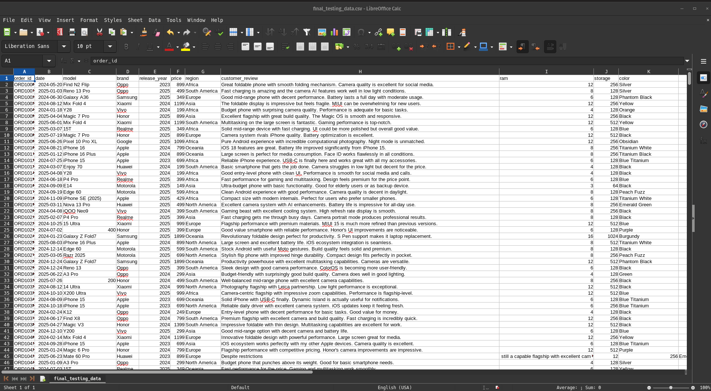
- Processed data in processed/ folder.
  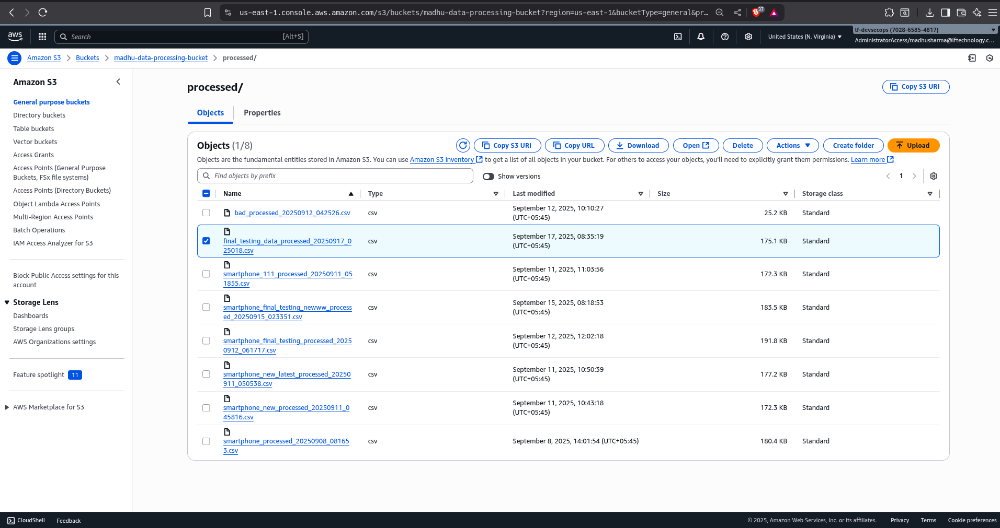
- Metadatas in Processed file stored in s3 for idempotency check.
  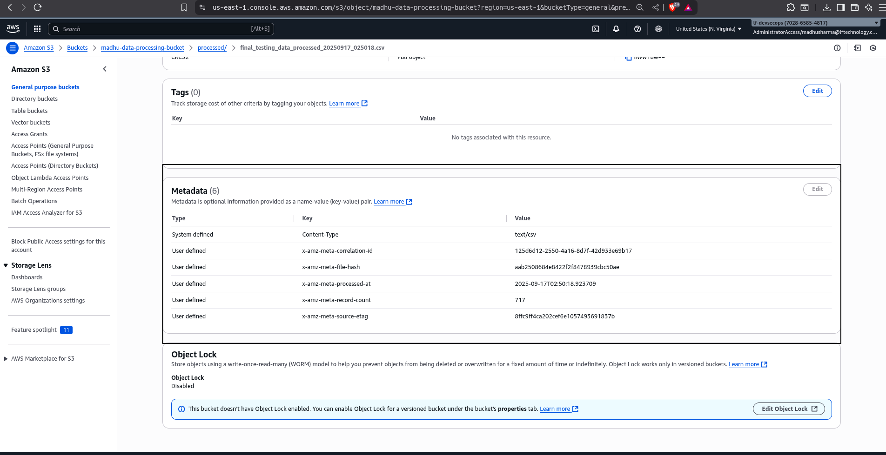

- Processed data
  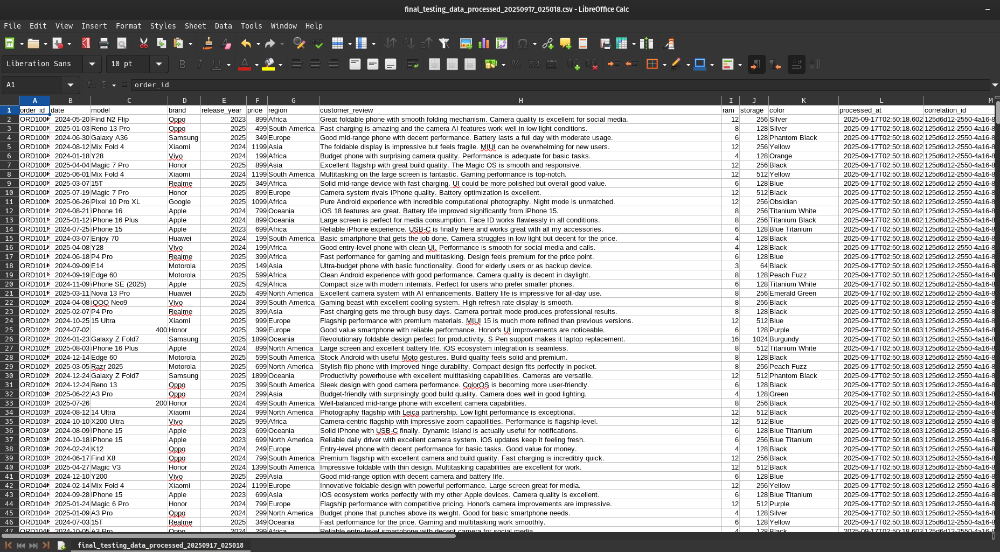

- Rejected data in rejected/ folder.
  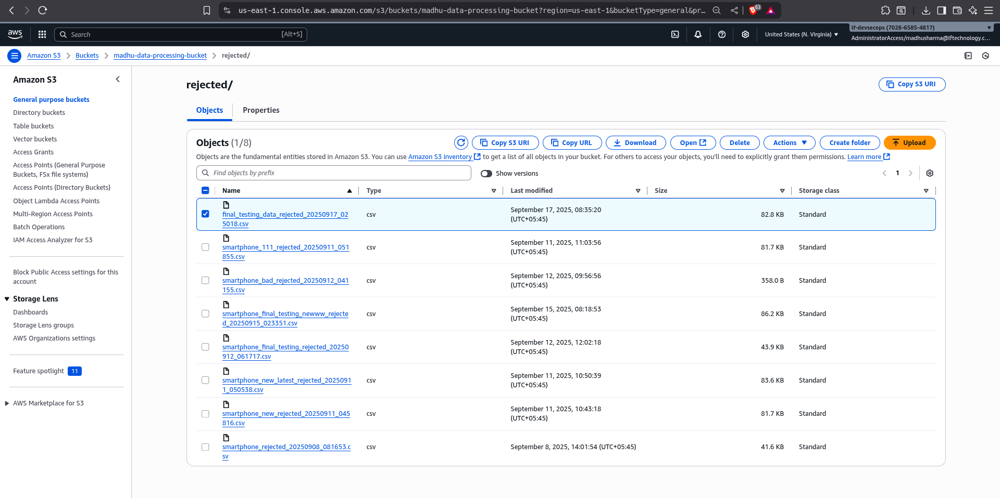
- Sample of Rejected data with reason for rejection:
  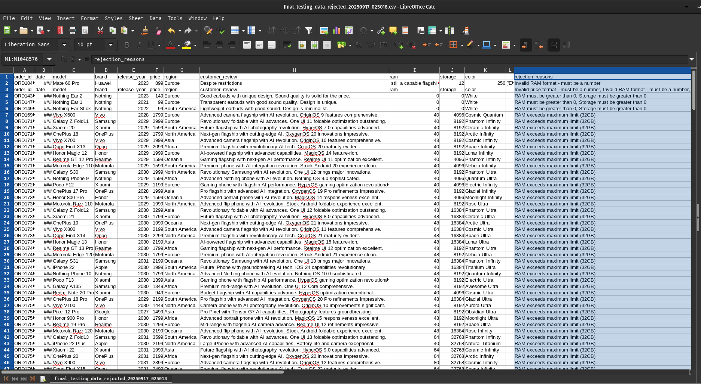

- DynamoDB is populated with results.
  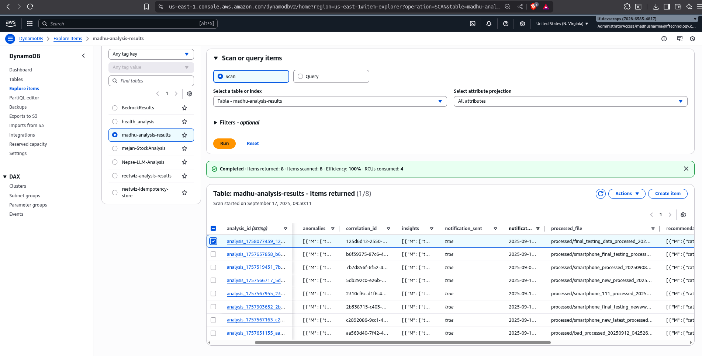
- Detail of a record in DynamoDB.
  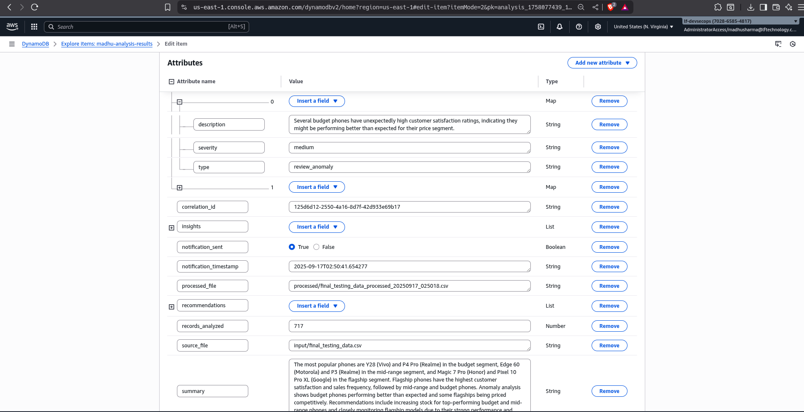
- SES email with analysis summary.
  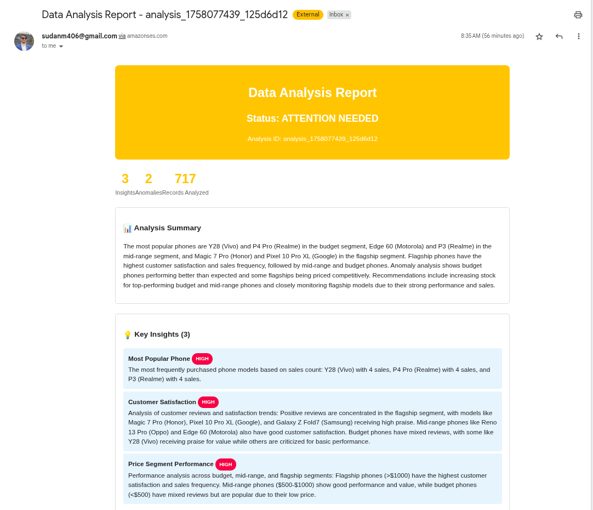
  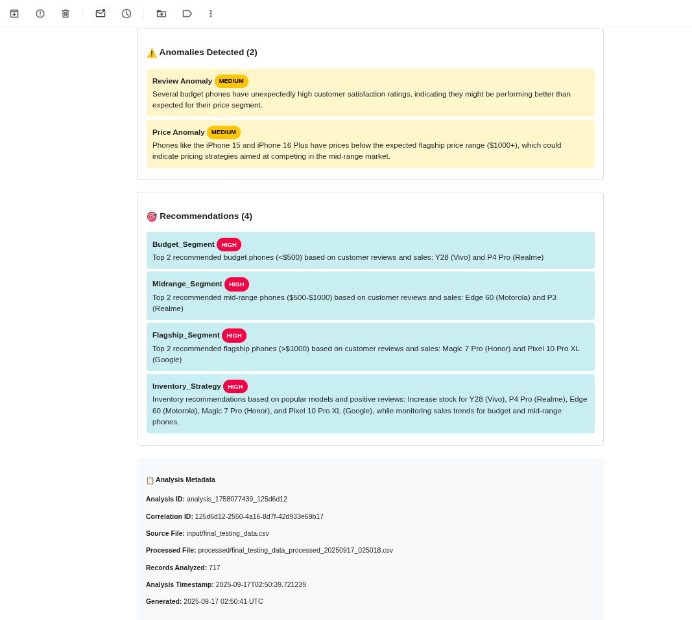
- CloudWatch alarm firing on failure.
  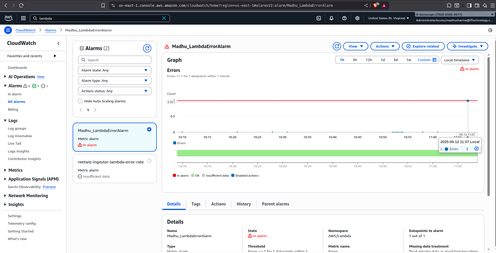
- Email Sent on Alarm Firing through SNS topic.
  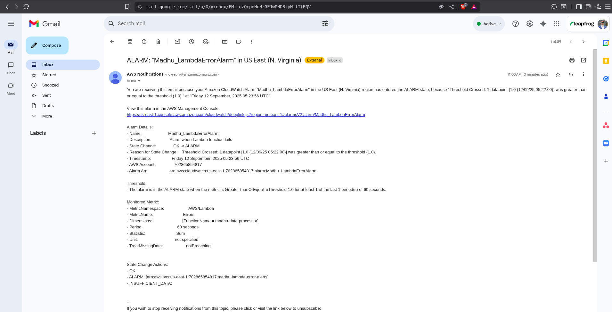

---

## Bedrock Cost Analysis for the Model Used

**Model Used**: `Amazon Nova Lite`

#### Token Breakdown Analysis

##### System Prompt

```text
You are a highly skilled and meticulous Data Analyst specializing in smartphone market trends. Your primary goal is to derive actionable business insights, identify critical anomalies, and formulate strategic recommendations from the provided sales data. Your analysis must be data-driven, precise, and presented in a structured JSON format.
```

**Token Count**: ~50 tokens

##### User Query Template

```text
You are a smartphone market analysis expert.

Analyze the following smartphone sales dataset with focus on customer reviews and market segments. Provide insights in JSON format.

The dataset contains sales records with fields including model, brand, price, customer_review, and region. Your job is to:
- Analyze customer sentiment from reviews to identify most positively reviewed phones
- Determine the most purchased/popular phone models based on sales frequency
- Categorize phones into price segments: Budget (<$500), Mid-range ($500-$1000), Flagship (>$1000)
- Provide targeted recommendations for each price segment

Here is the dataset:
{data_json}

Please respond ONLY with a JSON object in the following format:

{{
  "insights": [
    {{
      "type": "most_popular_phone",
      "description": "The most frequently purchased phone model with sales count",
      "confidence": "high/medium/low"
    }},
    {{
      "type": "customer_satisfaction",
      "description": "Analysis of customer reviews and satisfaction trends by brand/model",
      "confidence": "high/medium/low"
    }},
    {{
      "type": "price_segment_performance",
      "description": "Performance analysis across budget, mid-range, and flagship segments",
      "confidence": "high/medium/low"
    }}
  ],
  "anomalies": [
    {{
      "type": "review_anomaly",
      "description": "Unusual patterns in customer reviews or satisfaction",
      "severity": "high/medium/low"
    }},
    {{
      "type": "price_anomaly",
      "description": "Phones with pricing that doesn't match their segment expectations",
      "severity": "high/medium/low"
    }}
  ],
  "recommendations": [
    {{
      "category": "budget_segment",
      "action": "Top 2 recommended budget phones (<$500) based on customer reviews and sales",
      "priority": "high/medium/low"
    }},
    {{
      "category": "midrange_segment",
      "action": "Top 2 recommended mid-range phones ($500-$1000) based on customer reviews and sales",
      "priority": "high/medium/low"
    }},
    {{
      "category": "flagship_segment",
      "action": "Top 2 recommended flagship phones (>$1000) based on customer reviews and sales",
      "priority": "high/medium/low"
    }},
    {{
      "category": "inventory_strategy",
      "action": "Inventory recommendations based on popular models and positive reviews",
      "priority": "high/medium/low"
    }}
  ],
  "summary": "Brief summary focusing on most popular phones, customer satisfaction trends, and segment-wise recommendations"
}}

Focus on:
- Customer review sentiment analysis to identify highly rated phones
- Sales frequency to determine most popular models
- Price segment analysis (Budget: <$500, Mid-range: $500-$1000, Flagship: >$1000)
- Customer satisfaction patterns by brand and model
- Regional preferences and trends
- Value-for-money assessment based on price vs customer satisfaction

Avoid explaining the JSON format. Only return the structured output.
```

**Base Query Token Count**: ~450 tokens (excluding data)

#### Data Processing

- **Sample Data Format**:
  ```csv
  order_id,date,model,brand,release_year,price,region,customer_review,ram,storage,color
  ORD1000,2024-05-20,Find N2 Flip,Oppo,2023,899,Africa,Great foldable phone...
  ```
- **Average Tokens per Record**: ~50 tokens
- **For 1000 Records**: 50 × 1000 = 50,000 tokens

### Input Token Calculation

| Component              | Tokens     |
| ---------------------- | ---------- |
| System Prompt          | 50         |
| User Query             | 450        |
| Data (1000 records)    | 50,000     |
| **Total Input Tokens** | **50,500** |

### Output Token Estimation

| Component               | Estimated Tokens |
| ----------------------- | ---------------- |
| Summary                 | 150              |
| Insights                | 300              |
| Anomalies               | 200              |
| Recommendations         | 400              |
| **Total Output Tokens** | **1,050**        |

### Cost Calculation

#### Pricing Structure (Amazon Nova Lite)

- **Input Tokens**: $0.00006 per 1K tokens
- **Output Tokens**: $0.00024 per 1K tokens
  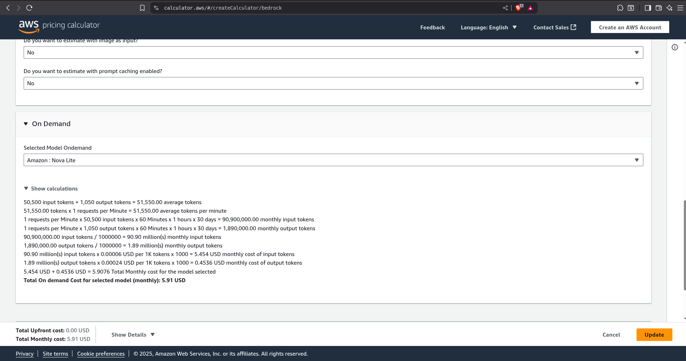
  Ref: [AWS Bedrock Pricing](https://calculator.aws/#/createCalculator/bedrock)

#### Cost Breakdown

| Type                       | Calculation                 | Cost (USD)    |
| -------------------------- | --------------------------- | ------------- |
| Input Cost                 | (50,500 ÷ 1,000) × $0.00006 | $0.00303      |
| Output Cost                | (1,050 ÷ 1,000) × $0.00024  | $0.000252     |
| **Total Cost per Request** |                             | **$0.003282** |

## Git back Sync
To keep the `dev` branch updated with the changes made directly to the `uat` branch, we can set up a Github Actions workflow that automatically creates a pull request from `uat` to `dev` whenever there are changes in the `uat` branch. This ensures that the `dev` branch always has the latest changes from `uat`. 
In this project also, this is implemented using the workflow file `.github/workflows/main.yaml`. It used github CLI commands to create a pull request from `uat` to `dev` branch.
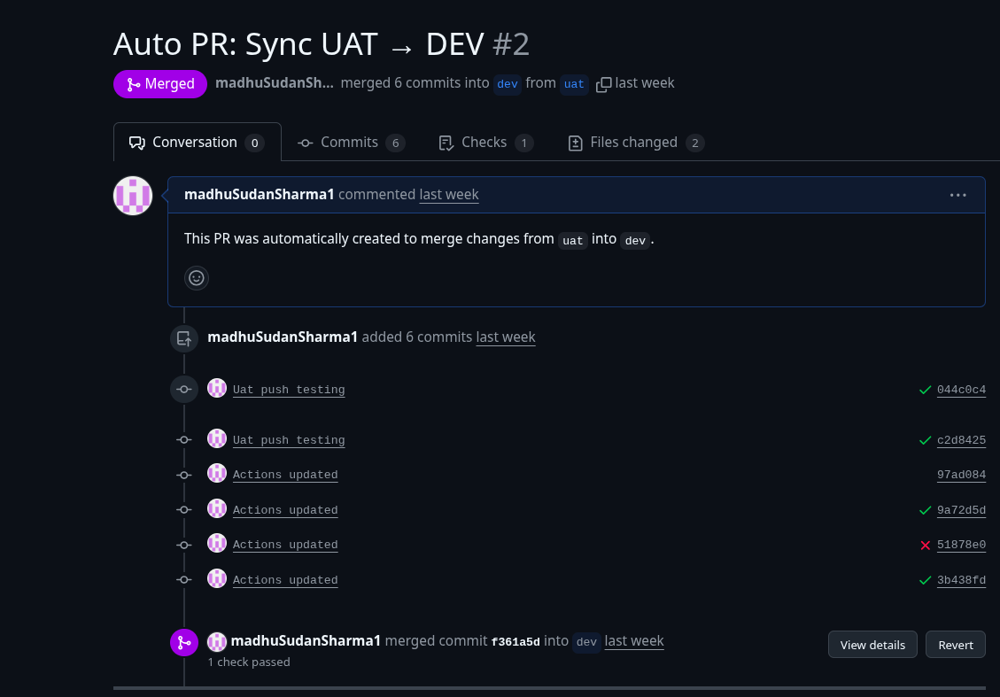 

### References

- [AWS Bedrock Pricing Calculator](https://calculator.aws/#/createCalculator/bedrock)
- [AWS Nova Request Schema](https://docs.aws.amazon.com/nova/latest/userguide/complete-request-schema.html)
- [Deploying Terraform Code via AWS CodeBuild and AWS CodePipeline](https://dev.to/aws-builders/deploying-terraform-code-via-aws-codebuild-and-aws-codepipeline-2l0)
